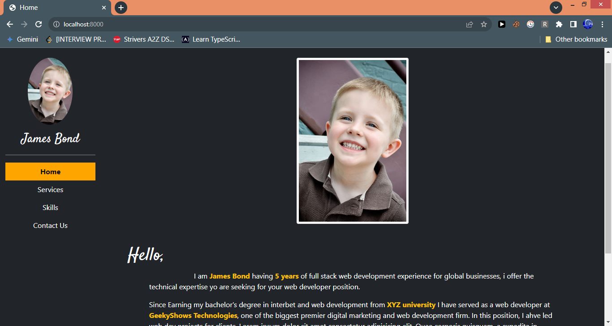

# Portfolio 

**Project Name:** Your Portfolio Website

**Description:** This is simple portfolio website showcasing skills, experience, and projects. It's designed to impress potential employers or clients and land dream job or project.

**Technologies Used:**

* **Front-End:**   
  <p align="center">
    <a href="https://skillicons.dev">
      
    </a>
  </p>
  
  * HTML: Provides the structure and content of the website.  
  * CSS: Styles the website for visual appeal and responsiveness.  
  * JavaScript: Adds interactive elements and animations.  
  * Bootstrap: A popular CSS framework that can simplify website development by providing pre-built styles and components.  
* **Back-End:**  
  <p align="center">
    <a href="https://skillicons.dev">
      
    </a>
  </p>

  * Django: A high-level Python web framework that can streamline development and manage the website's data and functionality.  
  * Sqlite: A lightweight database management system that can be used to store and manage website data.  

**Website Structure:**

* **Homepage:** Introduces with a clear and concise summary of skills and experience. Includes a call to action to explore work.  
* **Services:** Showcases work with details.  
* **Skills:** Highlights the technical and professional skillset.   
* **Contact:** Offers multiple ways for visitors to reach out, such as an email address, contact form, or social media links.  


**Development Setup:**

Paste the code in the terminal  
```
git clone https://github.com/akhtarmdsaad/resume-django.git
cd resume-django
python manage.py runserver
```

Open browser and type `localhost:8000` in the url bar.  

## Screenshots

